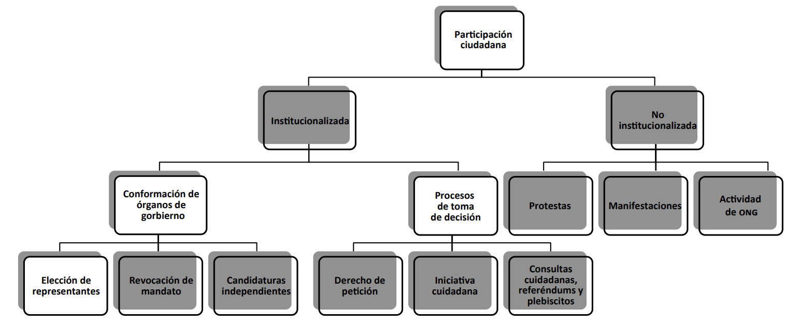
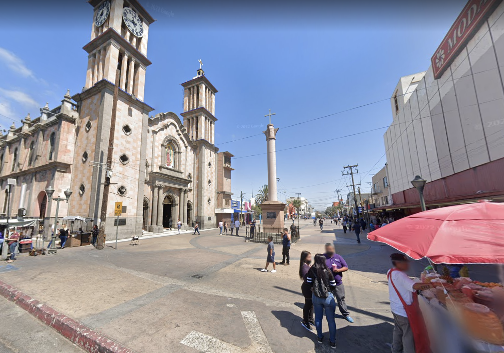

= Plan De Accion

== Estructura

=== Aumentar el poder de los mecanismos de participación ciudadana

En el marco legislativo estatal, específicamente en el artículo cinco de la Constitución Política del Estado Libre y Soberano de Baja California(CPELSBC) se
establecen, además del voto, cuatro mecanismos de participación ciudadana:

. La consulta popular

. La iniciativa ciudadana

. El plebiscito 

. El referéndum.

En Baja California solo se ha utilizado un instrumento de participación ciudadana, https://ieebc.mx/participacion-ciudadana/solicitudes-de-instrumentos-presentados/[en una sola ocasión], que fue el plebiscito

"Existe una clara diferencia en el uso de mecanismos de democracia
directa cuando su realización es resultado de una obligación constitucional, de una convocatoria por uno de los órganos de gobierno (el Ejecutivo, con frecuencia) o de una solicitud ciudadana"

"La experiencia
internacional indica que *los instrumentos más efectivos* para vincular
a la ciudadanía con los procesos de decisión públicos son aquellos que
*tienen origen en la misma ciudadanía*"

BRAVO ESCOBAR, Enrique. https://archivos.juridicas.unam.mx/www/bjv/libros/11/5099/10.pdf[Mecanismos de participación ciudadana en perspectiva comparada].
Páginas 311.

"Es fundamental contar con un protocolo claro para que las iniciativas ciudadanas sean consideradas de manera seria." 312

[[mecanismos-de-participacion]]
.Modalidades, categorías y mecanismos de participación ciudadana

BRAVO ESCOBAR, Enrique. https://archivos.juridicas.unam.mx/www/bjv/libros/11/5099/10.pdf[Mecanismos de participación ciudadana en perspectiva comparada].
Páginas 279.

=== Descentralizar poder municipal de Tijuana en varios Municipios

La ciudad de Tijuana ha crecido significativamente en los últimos años, convirtiéndose en una de las más grandes y pobladas de México. Sin embargo, con esta expansión también ha llegado la complejidad y la necesidad de abordar de manera más efectiva las necesidades de nuestra población.

Es por eso que proponemos dividir Tijuana en varios municipios para mejorar la eficiencia y efectividad en la toma de decisiones y la prestación de servicios, fomentar la participación ciudadana, impulsar el desarrollo económico local y abordar de manera más equitativa las necesidades de cada comunidad.

La descentralización de Tijuana también puede ser una medida efectiva para combatir la corrupción. Al dividir Tijuana en varios municipios, cada uno tendría una administración más pequeña y más cercana a la población, lo que permitiría una mayor transparencia y rendición de cuentas en la toma de decisiones y la gestión de los recursos públicos.

Además, la descentralización puede abrir la posibilidad de cambios significativos al dar a las comunidades más autonomía y poder de decisión en su propio entorno. Esto podría fomentar la innovación y el desarrollo de soluciones locales a problemas locales, lo que podría conducir a una mayor eficiencia y efectividad en la prestación de servicios y la toma de decisiones.

La descentralización de Tijuana en varios municipios es una medida que nos da la posibilidad de mejorar significativamente al bienestar de nuestra población, al desarrollo sostenible de nuestra ciudad y a la lucha contra la corrupción.

[[centro_delegacion]]
.Delegacion de Tijuana actualmente con el centro rellenado
image::../imagenes/centro-delegacion.jpeg["Delegacion de Tijuana actualmente con el centro sombrado"]

=== Playas de Tijuana
=== Centro
=== Cerro Colorado
=== Otay
=== Sánchez Taboada

== Seguridad

=== Derecho de Autodefensea

Buscamos promover el derecho a la autodefensa y el uso reglamentado y legal de armas de fuego para la auto defensa legítima en Tijuana, México, a través de la educación y el entrenamiento responsables, la transparencia y la rendición de cuentas en el proceso de obtención de licencias, la protección de aquellos que ejercen su derecho a la autodefensa legítima y la colaboración entre la comunidad y las fuerzas de seguridad locales.

. Promover la educación y el entrenamiento en el uso responsable de armas de fuego para la auto defensa. Esto incluiría la implementación de programas de capacitación obligatorios para aquellos que deseen obtener una licencia de portación de armas de fuego para la auto defensa.

. Fomentar la transparencia y la rendición de cuentas en el proceso de obtención de licencias de portación de armas de fuego para la auto defensa. Esto incluiría la eliminación de cualquier tipo de corrupción en el proceso y la implementación de medidas de seguridad para garantizar que solo aquellos que cumplan con todos los requisitos legales obtengan una licencia.

. Proteger a aquellos que ejercen su derecho a la autodefensa legítima de ser perseguidos penalmente. Esto incluiría la implementación de leyes que protejan a aquellos que actúan en autodefensa legítima de ser acusados ​​y condenados por sus acciones.

. Promover la colaboración entre la comunidad y las fuerzas de seguridad locales para fomentar una mayor seguridad en la ciudad. Esto incluiría programas comunitarios de vigilancia y la promoción de la denuncia de delitos a través de canales seguros y confidenciales.

== Urbanismo

=== Transporte publico y DOT

=== Promover densidad

* Prohibir estacionamiento de un piso
* Quitar todo requisito de construir estacionamiento con viviendas
* Poner viviendas en el parque morelos, amistad, y otros

=== Carril para transporte alternativo y protizacion del peaton

* Puentes peatonales
* Expander tamanno de banquetas
* Asegurar que banquetas son continuosas y que conectan de la forma mas eficiente a distintos reds. Crea callejones alumbradas con cameras de seguridad para permitir acceso rapio para el peaton.
* Plazas peatonales, sin coches

[[centro_plaza_peatonal_antes]]
.Calle en el Centro de Tijuana antes de ser convertido a plaza peatonal
image::../imagenes/centro-plaza-peatonal-antes.png["Calle en el Centro de Tijuana antes de ser convertido a plaza peatonal"]

[[centro_plaza_peatonal]]
.Convertido Plaza Peatonal Ejemplo en el Centro de Tijuana

=== Terrenos centricos Vacios

Aumento de predial en terrenos vacios muy centricos

=== Sistema de Cruce Express para cruzar las garitas

Tijuana es una ciudad ubicada en la frontera entre México y Estados Unidos, lo que significa que es un lugar de tránsito para muchas personas que cruzan la garita hacia San Diego. Sin embargo, el tráfico en la garita puede ser muy intenso en ciertos momentos del día, lo que puede resultar frustrante para aquellos que intentan cruzar y disuade visitar o vivir en Tijuana. Por esta razón, Tijuana necesita un sistema de citas para cruzar las gartias.

En primer lugar, un sistema de cruz exprés permitiría igualar la demanda de cruzar en días y tiempos con mucha demanda con días y tiempos con poco demanda. Actualmente, muchas personas tienen que esperar largas horas en la garita debido a la alta demanda y planear mucho tiempo para cruzar aunque hay tiempos con menos fila, lo que puede ser muy frustrante. Con un sistema de citas, las personas podrían programar su cruce con anticipación y saber con certeza cuándo podrán cruzar la garita. Esto también permitiría a las autoridades saber cuántas personas esperan cruzar en un momento dado y anticipar cuántas cruzarán cada día y hora, ayudándoles a administrar el tráfico de manera más eficiente.

Además, un sistema de cruz expresa podría ayudar a asegurar que siempre se pueda cruzar la garita en 15 minutos o menos. La fila gratuita con citas con anticipación permitiría a las personas que planifican con anticipación cruzar sin tener que esperar demasiado tiempo, mientras que la fila de cobro con precios dinámicos basados en la demanda permitiría a aquellos que necesitan cruzar de manera más rápida hacerlo a cambio de una tarifa. Esto podría ayudar a reducir la congestión en la garita y a asegurar que siempre se pueda cruzar de manera rápida y eficiente.

=== Aquellos que cruzan diariamente

Cruzar las garitas en Tijuana puede ser especialmente desagradable para aquellos que cruzan diariamente, como trabajadores que viven en Tijuana y trabajan en San Diego o estudiantes que asisten a escuelas en los Estados Unidos. Estos individuos pueden enfrentar muchas molestias de forma regular, lo que puede afectar significativamente su calidad de vida.

Un sistema de citas para cruzar la garita en Tijuana podría ser especialmente beneficioso para estos viajeros diarios, ya que les permitiría programar una cita en línea con anticipación para cruzar la frontera en un momento específico, lo que significa que solo tendrían que presentarse en la garita en el momento de su cita, evitando tener que pasar horas esperando en la fila física diariamente. Además, el sistema podría incluir un sistema de notificaciones para recordar a los viajeros sobre su cita y proporcionar actualizaciones sobre el tiempo de espera en tiempo real, lo que les ayudaría a planificar mejor su tiempo y reducir la incertidumbre.

=== Contra la manipulación y resistencia a la corrupción

Es importante diseñar bien el sistema de citas para prevenir abusos y asegurar que sea justo para todos los viajeros. Algunas medidas que se podrían implementar para prevenir el abuso del sistema incluyen:

* Implementar un sistema de deposito reembolsable minimo (alrededor de $100 pesos mexicanos), para reducir la tentación de sacar múltiples citas o vender citas.
* Verificar una forma de identificación con foto, como un pasaporte o una licencia de conducir, al momento de solicitar la cita. Una sola vez por cuenta. La verificación se confirma cada vez en el momento de cruzar.
* Restringir el número de citas por persona por día, para evitar que algunas personas bloqueen citas para varias personas y no vayan a su cita.
* Establecer una política clara para las cancelaciones y citas abandonados, para evitar que las citas se pierdan y asegurar que las personas solo reservan citas que realmente planean usar.
* Establecer un sistema de penalizaciones para aquellos que abusen del sistema, como cancelar sus citas futuras o prohibirles volver a usar el sistema.

==== Financiamiento

Además, implementar un deposito reembolsable o tarifa podría ayudar a auto-financiar el sistema de citas, lo que podría ayudar a mantenerlo operativo y mejorarlo continuamente. Es importante recordar que estas medidas deben ser cuidadosamente diseñadas para equilibrar la seguridad de evitar el abuso del sistema con el beneficio de facilitar el cruce para los viajeros regulares.
