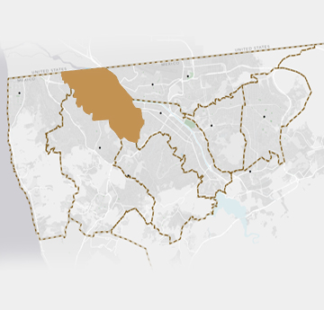

= Plan De Accion

== Estructura

=== Descentralizar poder municipal de Tijuana en varios Municipios

La ciudad de Tijuana ha crecido significativamente en los últimos años, convirtiéndose en una de las más grandes y pobladas de México. Sin embargo, con esta expansión también ha llegado la complejidad y la necesidad de abordar de manera más efectiva las necesidades de nuestra población.

Es por eso que proponemos dividir Tijuana en varios municipios para mejorar la eficiencia y efectividad en la toma de decisiones y la prestación de servicios, fomentar la participación ciudadana, impulsar el desarrollo económico local y abordar de manera más equitativa las necesidades de cada comunidad.

La descentralización de Tijuana también puede ser una medida efectiva para combatir la corrupción. Al dividir Tijuana en varios municipios, cada uno tendría una administración más pequeña y más cercana a la población, lo que permitiría una mayor transparencia y rendición de cuentas en la toma de decisiones y la gestión de los recursos públicos.

Además, la descentralización puede abrir la posibilidad de cambios significativos al dar a las comunidades más autonomía y poder de decisión en su propio entorno. Esto podría fomentar la innovación y el desarrollo de soluciones locales a problemas locales, lo que podría conducir a una mayor eficiencia y efectividad en la prestación de servicios y la toma de decisiones.

La descentralización de Tijuana en varios municipios es una medida que nos da la posibilidad de mejorar significativamente al bienestar de nuestra población, al desarrollo sostenible de nuestra ciudad y a la lucha contra la corrupción.

[[centro_delegacion]]
.Delegacion de Tijuana actualmente con el centro rellenado

=== Playas de Tijuana
=== Centro
=== Cerro Colorado
=== Otay
=== Sánchez Taboada

== Seguridad

=== Derecho de Autodefensea

Buscamos promover el derecho a la autodefensa y el uso reglamentado y legal de armas de fuego para la auto defensa legítima en Tijuana, México, a través de la educación y el entrenamiento responsables, la transparencia y la rendición de cuentas en el proceso de obtención de licencias, la protección de aquellos que ejercen su derecho a la autodefensa legítima y la colaboración entre la comunidad y las fuerzas de seguridad locales.

. Promover la educación y el entrenamiento en el uso responsable de armas de fuego para la auto defensa. Esto incluiría la implementación de programas de capacitación obligatorios para aquellos que deseen obtener una licencia de portación de armas de fuego para la auto defensa.

. Fomentar la transparencia y la rendición de cuentas en el proceso de obtención de licencias de portación de armas de fuego para la auto defensa. Esto incluiría la eliminación de cualquier tipo de corrupción en el proceso y la implementación de medidas de seguridad para garantizar que solo aquellos que cumplan con todos los requisitos legales obtengan una licencia.

. Proteger a aquellos que ejercen su derecho a la autodefensa legítima de ser perseguidos penalmente. Esto incluiría la implementación de leyes que protejan a aquellos que actúan en autodefensa legítima de ser acusados ​​y condenados por sus acciones.

. Promover la colaboración entre la comunidad y las fuerzas de seguridad locales para fomentar una mayor seguridad en la ciudad. Esto incluiría programas comunitarios de vigilancia y la promoción de la denuncia de delitos a través de canales seguros y confidenciales.

== Urbanismo

=== Carril para transporte alternativo y protizacion del peaton

=== Terrenos centricos Vacios

=== Sistema de Cruce Express para cruzar la frontera

Tijuana es una ciudad ubicada en la frontera entre México y Estados Unidos, lo que significa que es un lugar de tránsito para muchas personas que cruzan la garita hacia San Diego. Sin embargo, el tráfico en la garita puede ser muy intenso en ciertos momentos del día, lo que puede resultar frustrante para aquellos que intentan cruzar y disuade visitar o vivir en Tijuana. Por esta razón, Tijuana necesita un sistema de cruze express para cruzar la garita a San Diego con dos filas: una gratuita con citas con anticipación y otra de cobro con precios dinámicos basados en la demanda.

En primer lugar, un sistema de cruz exprés permitiría igualizar la demanda de cruzar en dias y tiempos con mucha demanda con dias y tiempos con poco demanda. Actualmente, muchas personas tienen que esperar largas horas en la garita debido a la alta demanda y planear mucho tiempo para cruzar aunque hay tiempos con menos fila, lo que puede ser muy frustrante. Con un sistema de citas, las personas podrían programar su cruce con anticipación y saber con certeza cuándo podrán cruzar la garita. Esto también permitiría a las autoridades saber cuántas personas esperan cruzar en cualquier momento dado y anticipar cuantos cruzaran cada dia y hora, lo que les ayudaría a manejar el tráfico de manera más eficiente.

Además, un sistema de cruze express podría ayudar a asegurar que siempre se pueda cruzar la garita en 15 minutos o menos. La fila gratuita con citas con anticipación permitiría a las personas que planifican con anticipación cruzar sin tener que esperar demasiado tiempo, mientras que la fila de cobro con precios dinámicos basados en la demanda permitiría a aquellos que necesitan cruzar de manera más rápida hacerlo a cambio de una tarifa. Esto podría ayudar a reducir la congestión en la garita y a asegurar que siempre se pueda cruzar de manera rápida y eficiente.

En conclusion, Tijuana necesita un sistema de cruze express para cruzar la garita a San Diego con dos filas: una gratuita con citas con anticipación y otra de cobro con precios dinámicos basados en la demanda. Esto permitiría igualizar la demanda de cruzar y dar certeza a la gente que cruza, y también ayudaría a asegurar que siempre se pueda cruzar la garita en 15 minutos o menos.